# UAS Bahasa Pemograman                     
#                                           
# NAMA : M. Aqil Al Farid                   
# Kelas : TI.20.B.1                         
# NIM : 312010140                           
#                                           
# ==========================================

Halo para mebaca sekalian , berikut saya mendapatkan Soal UAS Pemograman dari Kampus saya. Dan berikut Soalnya :

# Soal
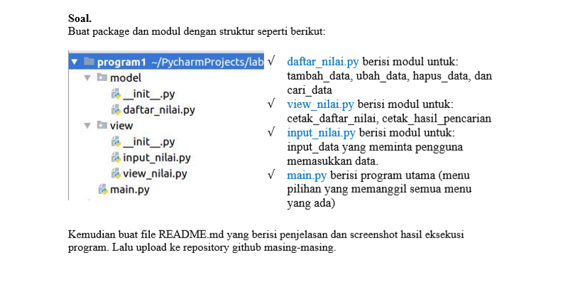

Dari Soal ini tertulis kita disuruh membuat Program Data Kuliah dengan package dan modul lalu kita kita push ke Github bererta data2 dan hasil bukti dengan scrennshot.

# Program Coding

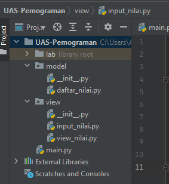

Dari gambar diatas kita telah membuat 3 data penting antara lain :

1. Package Model ( Daftar Nilai )
2. Package View ( Input Nilai dan View Nilai )
3. Modul Main

Setelah selesai paham yang akan kita ingin coding

# Kita akan Mulai dengan Package Model yakni (daftar_nilai)

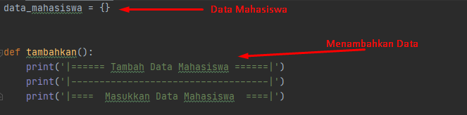

Pada gambar diatas telah ada petunjuk dengan maksud :

- Data Mahasiswa ( yang berisikan data2 mahasiswa yang akan kita input , hapus , ubah dll )
- Def Tambahan ( yang berisikan data untuk menambahkan data mahasiswa )

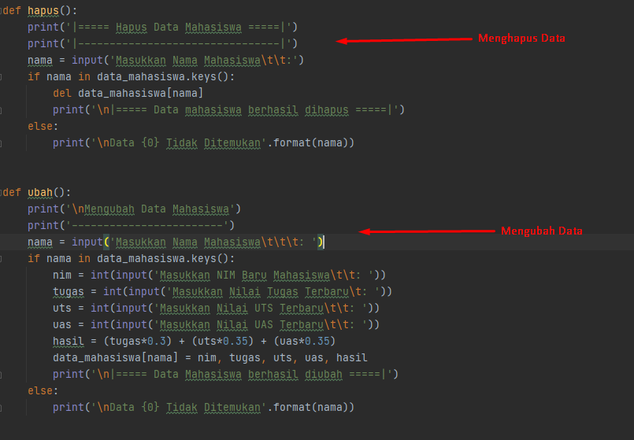

Pada gambar diatas kita telah ada petunjuk dengan maksud :

- Def Hapus ( yang berisikan untuk menghapus data bila ada yang data yang ingin kita hapus )
- Def Ubah ( yang berisikan untuk mengubah data mahasiswa, apabila ada kesalahan )

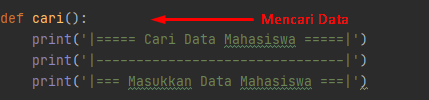

Pada gambar diatas merupakann dengan maksud:

- Def Cari ( yang berisikan untuk mencari data apabila data yang diinput lebih banyak dan akan lebih mudah

Selesai Program pada daftar_nilai

# Kita akan mulai dengan Package View ( Input Nilai dan View Nilai )

# 1. Input_Nilai

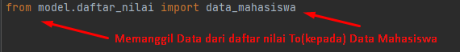

From digunakan untuk memanggil package sementara import untuk tujuan yang kita pilih yaitu modul daftar_nilai

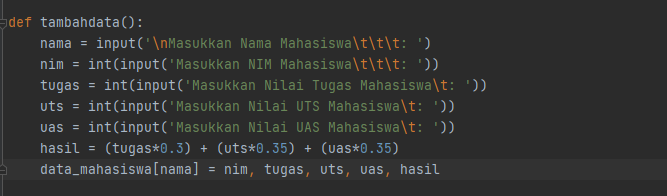

Disini kita buat inputan karena tadi kita sudah membuat kata - kata outputnya kali ini kita cukup membuat inputan data mahasiswanya saja

# 2. View_Nilai

From digunakan untuk memanggil package sementara import untuk tujuan yang kita pilih yaitu modul daftar_nilai

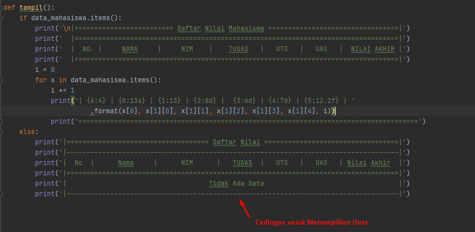

Pada gambar diatas adalah Codingan untuk Menampilkan Data yang telah kita buat 

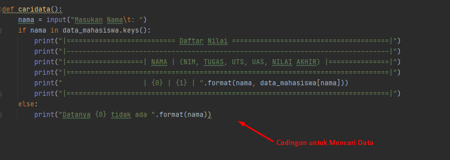

Pada gambar diatas adalah Codingan untuk Mencari Data

Selesai Program pada Package View ini 

# Kita akan membuat Modul Main.py

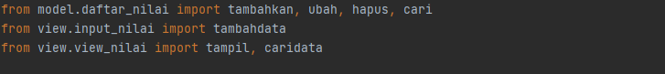

Penjelasan:

- Sama seperti sebelumnya hanya saja disini sedikit berbeda
- From disini kita tulis package.modulnya lalu import fungsi(def) tadi
- Karena dibagian main ini kita akan menggunakan atau membuat syntax pilihan menu

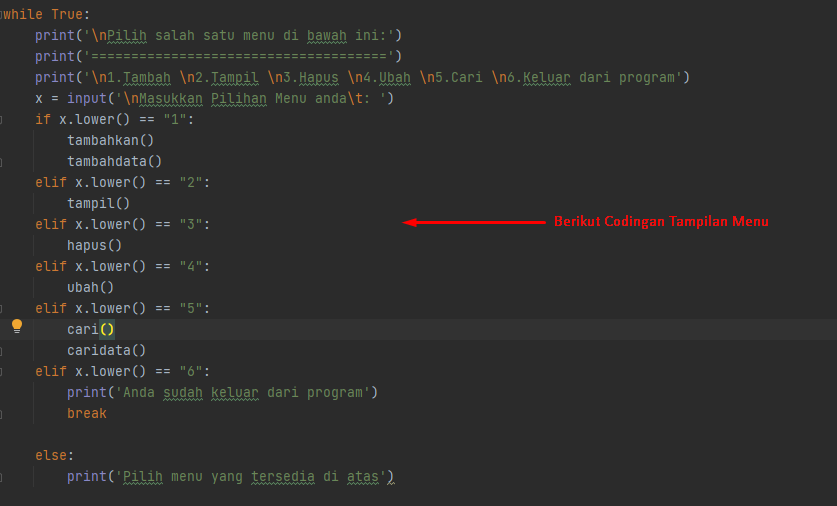

Pada gambar diatas berikut Syntax/Codingan untuk pilihan menu .

Setelah selesai semua sudah kita coding, Next kita jalankan Perintah RUN !

# ================================================================================

# Program yang kita RUN

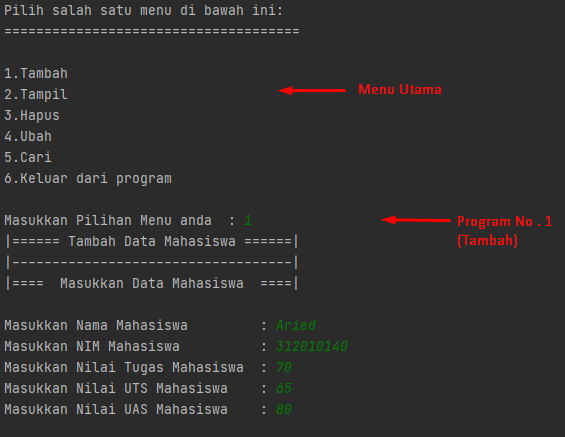

Gambar diatas adalah contoh menu dan kita akan mencoba dari awal yakni pilihan No.1 (Tambah Data Mahasiswa)

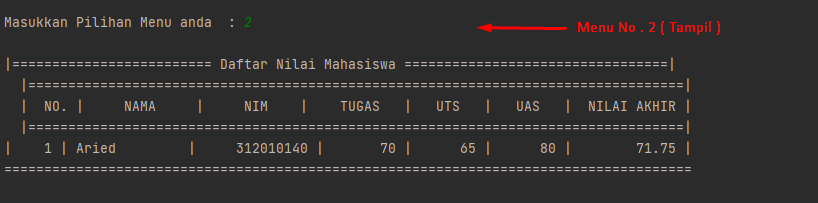

Gambar diatas adalah Kita memilih menu No. 2 ( Melihat Hasil Tampilan dari Data yang kita tambah )

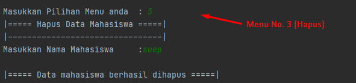

Gambar diatas adalah kita memilih Menu No. 3 ( Menghapus Data ) , Sebelum menghapus pastikan kalian mencoba dengan Minimal dengan 2 Data agar 1 nya bisa kita hapus

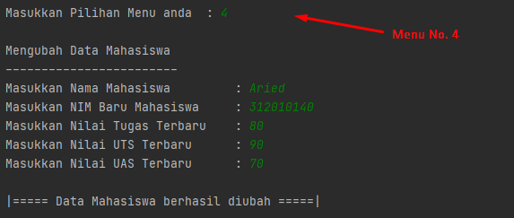

Gambar diatas adalah kita memilih Menu no.4 ( Mengubah Data ) , Gunanya agar jika kita ingin menghubah Data ,Contoh Nama/NIM/Nilai .

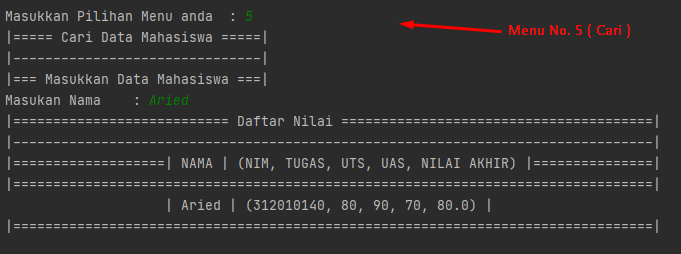

Gambar diatas adalah kita memilih Menu no.5 ( Mencari Data ), jika kita sudah menghubah/meghapus/menambah kita bisa mencari Data tersebut.

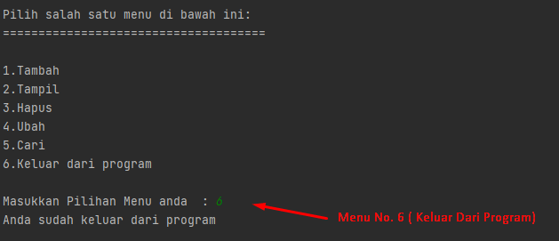

Gambar diatas adalah gunanya apabila kita telah selesai Mengupdate data-data , kita bisa keluar dari program tersebut.

Sekitan yang bisa saya sampaikan , apabila ada kesalahan Mohon Maaf dan terima kasih.

